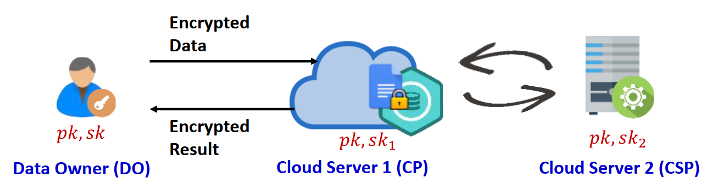

#<center>Secure Computation on Integers Scheme -- C/C++ Project

# SOCI

SOCI (secure outsourced computation on integers scheme) provides a twin-server architecture for secure outsourced computation based on Paillier cryptosystem, which supports computations on encrypted integers rather than just natural numbers [1]. It significently improves the computation efficiency compared with fully homomorphic encryption mechanism. SOCI includes a suite of efficient secure computation protocols, including secure multiplication ($\textsf{SMUL}$), secure comparison ($\textsf{SCMP}$), secure sign bit-acquisition ($\textsf{SSBA}$) and secure division ($\textsf{SDIV}$). The protocols realize secure computations on both non-negative integers and negative integers. 


# Preliminary

The protocols in SOCI are built based on Pailliar cryptosystem with threshold decryption (PaillierTD), which is a variant of the conventional Paillier cryptosystem. PaillierTD splits the private key of the Paillier cryptosystem into two partially private keys. Any partially private key cannot effectively decrypt a given ciphertext encrypted by the Paillier cryptosystem. PaillierTD consists of the following algorithms.

$\textbf{Key Generation} (\textsf{KeyGen})$: Let $p,q$ be two strong prime numbers (i.e., $p=2p'+1$ and $q=2q'+1$, where $p'$ and $q'$ are prime numbers) with $\kappa$ bits (e.g., $\kappa=512$). Compute $N=p\cdot q$, $\lambda=lcm(p-1,q-1)$ and $\mu=\lambda^{-1}\mod N$. Let the generator $g=N+1$, the public key $pk=(g,n)$ and the private key $sk=\lambda$.

The private key $\lambda$ is split into two parts denoted by $sk_1=\lambda_1$ and $sk_2=\lambda_2$, s.t., $\lambda_1+\lambda_2=0\mod\lambda$ and $\lambda_1+\lambda_2=1\mod N$. According to the Chinese remainder theorem, we can calculate $\sigma=\lambda_1+\lambda_2=\lambda\cdot\mu\mod(\lambda\cdot\mu)$ to make $\delta=0\mod\lambda$ and $\delta=1\mod N$ hold at the same time, where $\lambda_1$ can be a $\sigma$-bit random number and $\lambda_2=\lambda\cdot\mu+\eta\cdot\lambda N-\lambda_1$ ($\eta$ is a non-negative integer).

$\textbf{Encryption} (\textsf{Enc})$: Taken as input a message $m\in\mathbb{Z}_N$, this algorithm outputs $[\![m]\!]\leftarrow\textsf{Enc}(pk,m)=g^m\cdot r^N\mod N^2$, where $r$ is a random number in $\mathbb{Z}^*_N$ and $[\![m]\!]=[\![m\mod N]\!]$. 

$\textbf{Decryption} (\textsf{Dec})$: Taken as input a ciphertext $[\![m]\!]$ and $sk$, this algorithm outputs $m\leftarrow\textsf{Dec}(sk,[\![m]\!])=L([\![m]\!]^{\lambda}\mod N^2)\cdot\mu\mod N$, where $L(x)=\frac{x-1}{N}$.

$\textbf{Partial Decryption} (\textsf{PDec})$: Take as input a ciphertext $[\![m]\!]$ and a partially private key $sk_i$ ($i\in\{1,2\}$), and outputs $M_i\leftarrow\textsf{PDec}(sk_i,[\![m]\!])=[\![m]\!]^{\lambda_i}\mod N^2$.

For brevity, we will omot $\mod N^2$ for $\textsf{Enc}$ algorithm in the rest of the document.

PaillierTD has the additive homomorphism and scalar-multipilication homomorphism as follows.

- Additive homomorphism: $\textsf{Dec}(sk,[\![m_1+m_2\mod N]\!])=\textsf{Dec}(sk,[\![m_1]\!]\cdot[\![m_2]\!])$;

- Scalar-multiplication homomorphism: $\textsf{Dec}(sk,[\![c\cdot m\mod N]\!])=\textsf{Dec}(sk,[\![m]\!]^c)$ for $c\in\mathbb{Z}^*_N$. Particularly, when $c=N-1$, $\textsf{Dec}(sk,[\![m]\!]^c)=-m$ holds.


# System Architecture


The system architecture of SOCI is shown in the figure above, which consists of a data owner (DO) and two servers, i.e., a cloud platform (CP) and a computation service provider (CSP).

- DO: DO takes charge of generating and distributing keys to CP and CSP securely. Specifically, DO calls the $\textsf{KeyGen}$ algorithm to generate public/private key pair $(pk,sk)$ for Paillier cryptosystem and then splits $sk$ into two partially private keys $(sk_1, sk_2)$. Next, DO distributes $(pk,sk_1)$ and $(pk, sk_2)$ to CP and CSP, respectively. To protect data privacy, DO encrypts data with $pk$ and outsources encrypted data to CP. Besides, DO outsources computation services over encrypted data to CP and CSP.
- CP: CP stores and manages the encrypted data sent from DO, and produces the intermediate results and the final results in an encrypted form. In addition, CP can directly execute certain calculations over encrypted data such as homomorphic addition and homomorphic scalarmultiplication. CP interacts with CSP to perform $\textsf{SMUL}$, $\textsf{SCMP}$, $\textsf{SSBA}$, and $\textsf{SDIV}$ over encrypted data.
- CSP: CSP only provides online computation services and does not store any encrypted data. Specifically, CSP cooperates with CP to perform secure computations (e.g., multiplication, comparison, division) on encrypted data.


# SOCI API Description

The project in this version is written in C/C++.

## Paillier.keygen()

Taken as input a security parameter $\kappa$, this algorithm generates two strong prime numbers $p$, $q$ with $\kappa$ bits. Then, it compute $N = p\cdot q$, $\lambda=lcm(p-1,q-1)$, $\mu=\lambda^{-1}\mod N$ and $g= N+1$. It outputs the public key $pk=(g,N)$ and private key $sk=\lambda$.


## ThirdKeyGen.thdkeygen()
Taken as input the private key  $sk$ , this algorithm computes $sk_1$ and $sk_2$. The cloud platform stores $cp=(pk,sk_1)$ and the computation service provider stores $csp=(pk, sk_2)$.

The private key $sk=\lambda$ is split into two parts denoted by $sk_1 = \lambda_1$ and $sk_2 = \lambda_2$, s.t., $\lambda_1+\lambda_2=0\mod\lambda$ and $\lambda_1+\lambda_2=1\mod N$. 


## Paillier.encrypt()
Taken as input a plaintext $m$ which is mpz_t type,  this algorithm encrypts $m$ into ciphertext $c$ with public $pk$. The output ciphertext $c$ is also mpz_t type. In the computations of SOCI, the value of message m should be between $-N/2$ and $N/2$.

Note: mpz_t is a GMP data type which is a multiple precision integer. 

## Paillier.decrypt()
Taken as input a ciphertext $c$,  this algorithm decrypts $c$ into plaintext $m$ with secret key $sk$. Both $c$ and $m$ are mpz_t type. The input ciphertext $c$ should be between 0 and $N^2$ to guarantee correct decryption.


## PaillierThd.pdec()
Given a ciphertext $c$, this algorithm partial decrypts $c$ into partially decrypted ciphertext $C_1$ with partial secret key $sk_1$, or partial decrypts $c$ into $C_2$ with $sk_2$. Both $C_1$ and $C_2$ are and mpz_t type.

## PaillierThd.fdec()
Given partially decrypted ciphtexts $C_1$ and $C_2$ are partially decrypted ciphertext of c, this algorithm outputs the plaintext $m$ of $c$. The output plaintext $m$ is mpz_t type.

## Paillier.add()
Given two ciphertext $c_1$ and $c_2$,  this algorithm computes the additive homomorphism and output the result $res$. Suppose $c_1=[\![m_1]\!]$ and $c_2=[\![m_2]\!]$. Then, the result $res=[\![m_1+m_2]\!]$. The input ciphertexts $c_1$ and $c_2$ should be mpz_t type and the values should between 0 and $N^2$. The outputresult res is also mpz_t type.

## Paillier.scl_mul()
Given a ciphertext $c_1$ and a plaintext integer $e$,  this algorithm computes the scalar-multiplication homomorphism and output the result $res$. Suppose $c_1=[\![m_1]\!]$. Then, the result $res=[\![m_1]\!]^e$.
 The input ciphertext $c_1$ should between 0 and $n^2$, $e$ is a plaintext and should be between 0 and $n$. Both of $c_1$ and $e$ should be mpz_t type. The result $res$ is also mpz_t type.

## PaillierThd.smul()
Given ciphertexts $ex$ and $ey$, this algorithm computes the multiplication homomorphism and outputs the result $res$. Suppose $ex=[\![x]\!]$ and $ey=[\![y]\!]$. Then, the result $res=[\![x\cdot y]\!]$. The result $res$ is mpz_t type.

## PaillierThd.scmp()
Given ciphertexts $ex$ and $ey$, this algorithm computes the secure comparison result $res$. Suppose $ex=[\![x]\!]$ and $ey=[\![y]\!]$. Then, the result $res=[\![1]\!]$ if $x \lt y$, and $res=[\![0]\!]$ if $x\geq y$.  The result $res$ is mpz_t type.

## PaillierThd.ssba()
Given a ciphertext $ex$, this algorithm computes the secure sign bit-acquisition result $s_x$ and $u_x$. Suppose $ex=[\![x]\!]$. Then, the result $s_x=[\![1]\!]$ and $u_x=[\![-x]\!]$ if $x<0$, and $s_x=[\![0]\!]$ and $u_x=[\![x]\!]$ if $x\geq 0$.  Both $s_x$ and $u_x$ are mpz_t type ciphertext.

## PaillierThd.sdiv()

Given ciphertexts $ex$ and $ey$ (say $ex=[\![x]\!]$ and $ey=[\![y]\!]$), this algorithm computes the encrypted quotient $eq$ and the encrypted remainder $er$ of $x$ divided by $y$. Another input is a ciphertext $el$ ($el=[\![\ell]\!]$), where $\ell$ is a constant (e.g., $\ell$ = 32) used to control the domain size of plaintext.


# build Dependencies

* OS: Ubuntu 20.04 LTS.
* make,g++
* GMP

# GMP
[GMP](https://gmplib.org/) is a free library for arbitrary precision arithmetic, operating on signed integers, rational numbers, and floating-point numbers.


## install GMP
Download GMP from [GMP](https://ftp.gnu.org/gnu/gmp/) . you can choose “gmp-6.2.0.tar.xz”.
* Unzip it

Click terminal and type
```sh
tar -xvf gmp-6.2.0.tar.xz
```
* Go to gmp-6.2.0
```sh
cd gmp-6.2.0
```
* config
```sh
./configure --prefix=/usr --enable-cxx
```

* make
```sh
make
make check
sudo make install
```

# Build SOCI
```sh
make
```

## Run SOCI
```sh
./bin/soci
```
## Output:
    set x = -99, y = -789
    run add function, its running time is  ------  0.004000 ms
    x + y = -888
    ---------------------------
    set x = -99, y = -789
    compute scl_mul function, its running time is  ------  0.044000 ms
    x*y = 78111
    ---------------------------
    Secure computation protocols
    set x = -99, y = -789
    compute SMUL function, its running time is  ------  15.234000 ms
    x*y = 78111
    ---------------------------
    set x = -99, y = -789
    compute SCMP function, its running time is  ------  7.397000 ms
    x>=y? = 0
    ---------------------------
    set x = -99
    compute SSBA function, its running time is  ------  23.278000 ms
    s_x = 1 u_x = 99
    ---------------------------
    set x = 5429496723, y = 9949672
    compute SDIV function, its running time is  ------  739.991000 ms
    q = 545 r = 6925483
    ---------------------------


# Benchmark
in src/Main.cpp, you can change the value of KEY_LEN_BIT and SIGMA_LEN_BIT . KEY_LEN_BIT determine the big prime's length in bit, and  SIGMA_LEN_BIT determine sk1's length in bit.

# Reference

1. Bowen Zhao, Jiaming Yuan, Ximeng Liu, Yongdong Wu, Hwee Hwa Pang, and Robert H. Deng. SOCI: A toolkit for secure outsourced computation on integers. IEEE Transactions on Information Forensics and Security, 2022, 17: 3637-3648.

2. Bowen Zhao, Yingjiu Li, Ximeng Liu, Hwee Hua Pang, and Robert H. Deng. FREED: An efficient privacy-preserving solution for person re-identification. IEEE Conference on Dependable and Secure Computing (DSC), 2022, pp. 1-8.